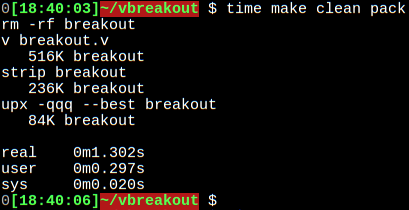

A simple breakout game.

Use arrows to move the paddle. The goal is to keep the ball from falling through the floor.
TODO: add bricks layer so that the ball can break them.


Building:
```shell
$ v breakout.v

Executable size after compiling, striping and upx compressing:


