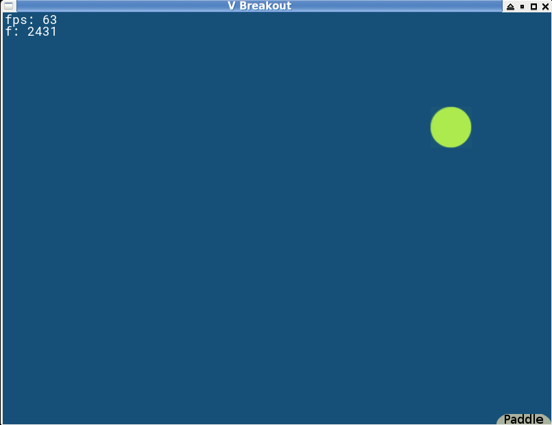
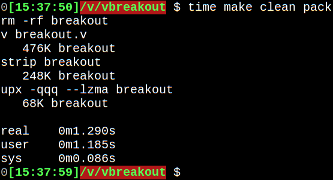

A simple breakout game.

Use arrows to move the paddle. The goal is to keep the ball from falling through the floor.

TODO: add bricks too so that the ball can break them.



Building:
```shell
$ v breakout.v
```

Executable size after compiling, striping and upx compressing is < 100KB !



